# AWS-Based ETL Pipeline for Industrial Sensor Data Analytics

## 1. Project Overview

This project demonstrates an end-to-end AWS-based ETL pipeline using the NASA CMAPSS jet engine sensor dataset.

The goal of the project was to understand how raw sensor data can be ingested, transformed, stored, queried and visualized using modern data engineering tools.

The project simulates a realistic data workflow where data starts from a structured local source system, moves into AWS cloud storage, is transformed using AWS Glue, queried using Amazon Athena, and finally visualized in Power BI.

---

## 2. Architecture

### Final Architecture

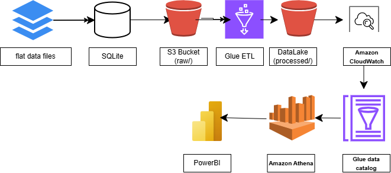
```text
Architecture Explanation
- SQLite was used to simulate a structured source database.
- Python extracted the data from SQLite and uploaded it to S3.
- Amazon S3 stored both raw and processed data.
- AWS Glue ETL transformed the raw data into analytics-ready datasets.
- AWS Glue Data Catalog stored table metadata.
- Amazon Athena queried the processed data using SQL.
- Power BI visualized the final insights.
```
---

## 3. Dataset

The project uses the [NASA CMAPSS jet engine degradation dataset](https://data.nasa.gov/dataset/cmapss-jet-engine-simulated-data).

The dataset contains simulated time-series sensor readings from multiple jet engines. Each row represents one engine at one operating cycle.

Main fields

- engine_id
- cycle
- op_setting_1, op_setting_2, op_setting_3
- sensor_1 to sensor_21

This type of dataset is useful for condition monitoring, predictive maintenance and Remaining Useful Life analysis.

---

## 4. Tools and Technologies Used

|Tool / Service|	Purpose|
|--------------|-----------|
|Python	|Data extraction from SQLite to S3|
|SQLite| structured source database|
|Pandas|	Initial local data handling|
|Amazon S3	|Raw and processed cloud storage|
|AWS Glue ETL|	Cloud-based data transformation|
|AWS Glue Data Catalog|	Metadata catalog for processed data|
|Amazon Athena|	SQL querying over S3 data|
|Power BI|	Dashboard and visualization|
|Terraform|	Infrastructure as Code|
|CloudWatch	|Glue job logs and monitoring|
|ODBC Driver|	Connection between local Power BI and Athena|
---
## 5. Pipeline Steps
#### Step 1: Source Data Preparation

The original CMAPSS data was available as a flat text file. To simulate a realistic source system, the data was first loaded into a local SQLite database.

This helped simulate a scenario where data originates from a structured database instead of a simple file.

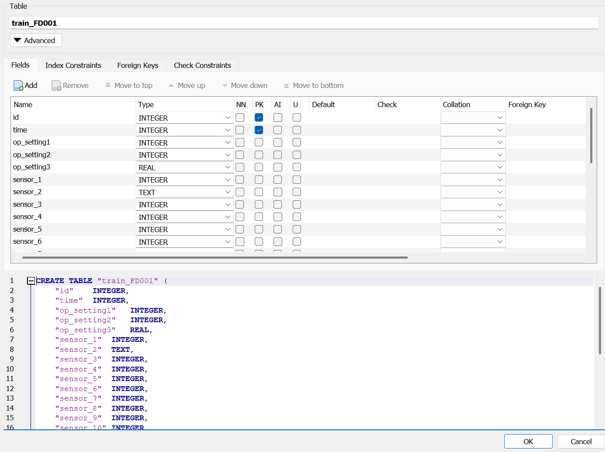

#### Step 2: Infrastructure Provisioning with Terraform

Terraform was used to provision the main AWS resources.

Resources created:

- S3 bucket
- S3 folder
- CloudWatch log group
- IAM role for Glue
- AWS Glue ETL job
- Glue Data Catalog
- Glue Crawler

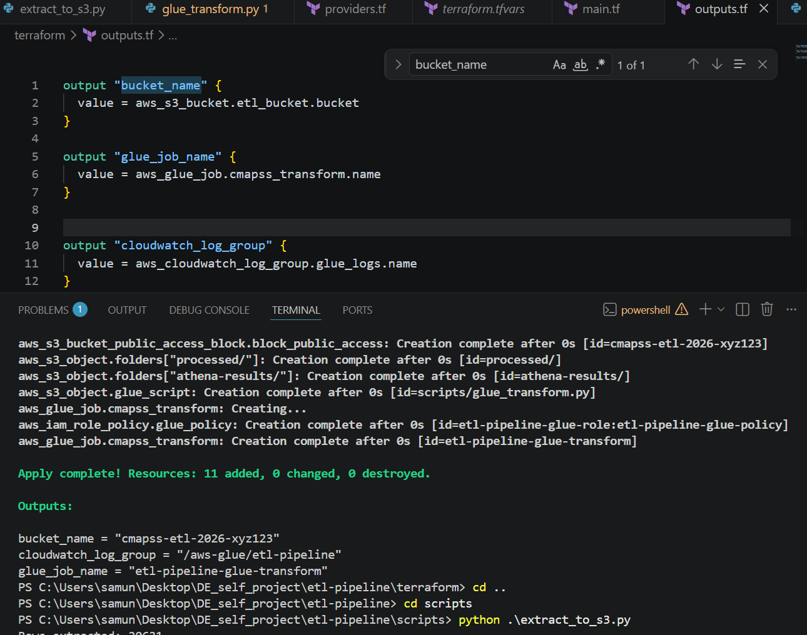

#### Step 3: Data Extraction from SQLite to S3 Raw Layer

A Python script was used to extract data from SQLite and upload it to the S3 raw layer.

Flow
SQLite Database -> Python Script -> S3 raw/
Output
s3://<bucket-name>/raw/train_fd001_raw.csv

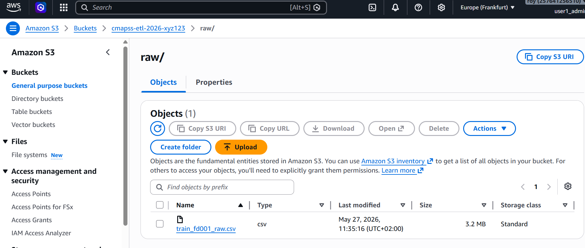

#### Step 4: AWS Glue ETL Transformation

AWS Glue ETL was used to transform the raw data directly inside AWS.

Transformations performed were:
1. Read raw CSV from S3
2. Keep valid and required columns
3. Rename columns to meaningful/business-friendly names
4. Convert columns to numeric data types
5. Remove duplicate and null records
6. Calculate Remaining Useful Life
7. Data Modeling: Create a cycle-level fact table and engine-level summary table
8. Add a simple health category
9. Write processed outputs back to S3

Processed Outputs
s3://<bucket-name>/processed/fact_engine_cycles/
s3://<bucket-name>/processed/engine_health_summary/

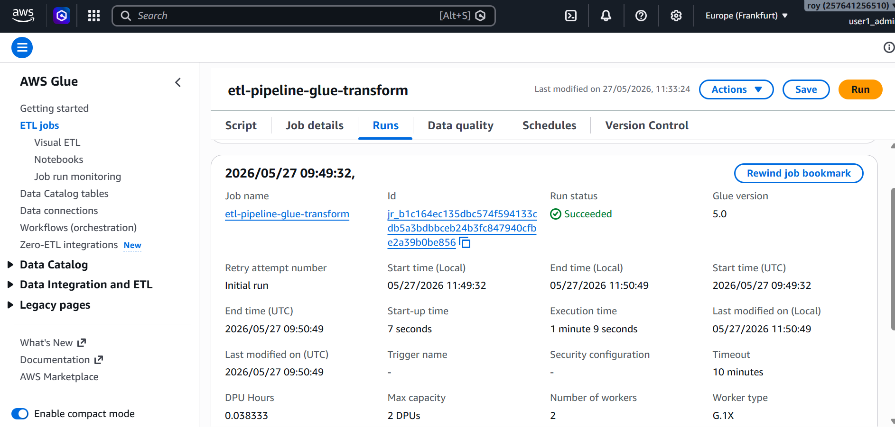

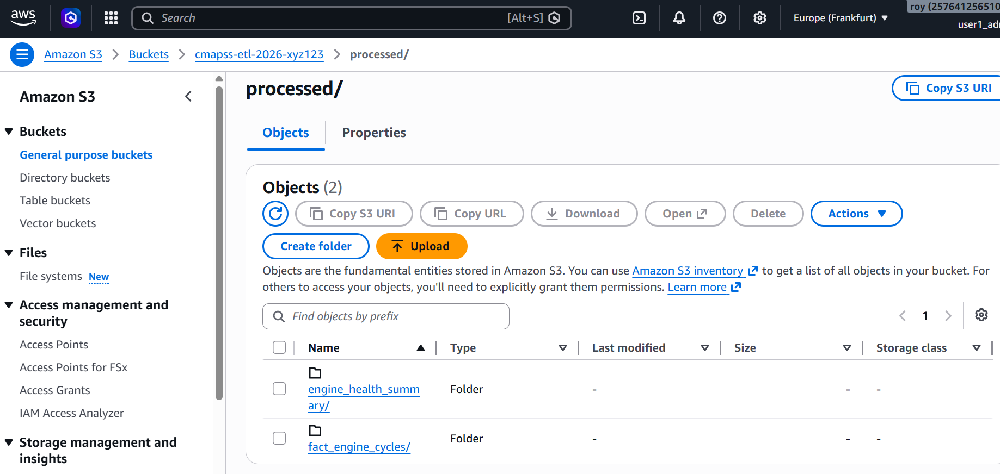

#### Data Modeling

The transformation step created two analytics-ready datasets.

1. fact_engine_cycles

Grain:

One row per engine per cycle

Purpose:

- Sensor trend analysis
- RUL trend analysis
- Cycle-level monitoring

Example columns: engine_id, cycle, rul, selected sensor columns

2. engine_health_summary

Grain:

One row per engine

Purpose:

- Dashboard KPIs
- Engine-level comparison
- Health category distribution

Example columns: engine_id,
total_cycles,
average sensor values,
health_bucket,
anomaly_flag

#### Step 5: Glue Data Catalog and Glue Athena

After the Glue ETL job created processed files, a Glue crawler was used to scan the processed S3 folders and create table metadata in the Glue Data Catalog.

Athena (an AWS-based SQL query engine) then used this metadata to query the S3 data using SQL.

<i> Example Athena Queries </i>
```
SELECT * FROM engine_health_summary LIMIT 10;

SELECT health_bucket, COUNT(*) AS engine_count FROM engine_health_summary
GROUP BY health_bucket;

SELECT engine_id, cycle, rul, sensor_11 FROM fact_engine_cycles
WHERE engine_id = 1 ORDER BY cycle;

```
Glue Crawler
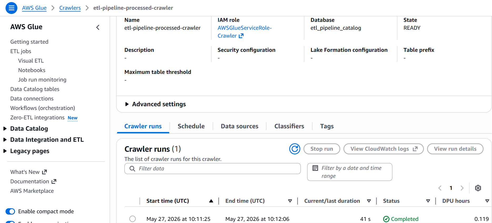

Data Catalog
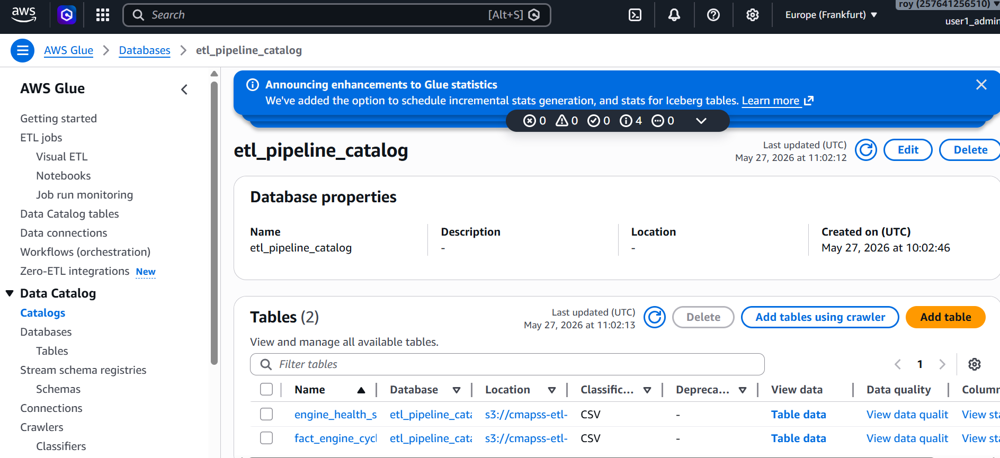

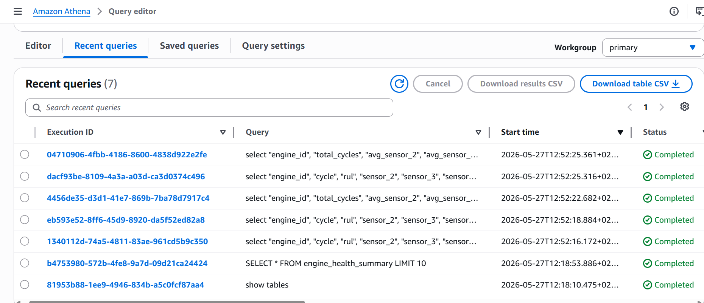

#### Step 6: Power BI Dashboard

Power BI Desktop was installed locally and connected to Athena using an ODBC connection with the <i> Amazon Athena ODBC driver </i>.

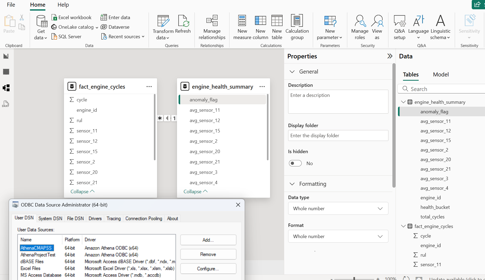

The dashboard includes: 

Total number of engines,
Average total cycles,
Health bucket distribution,
Engine lifecycle comparison,
Remaining Useful Life trend,
Sensor trend over cycles,

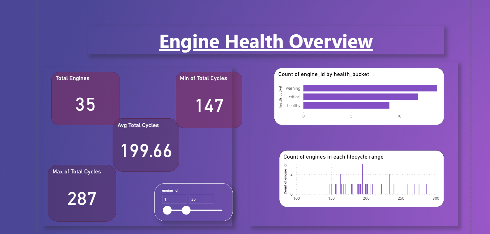
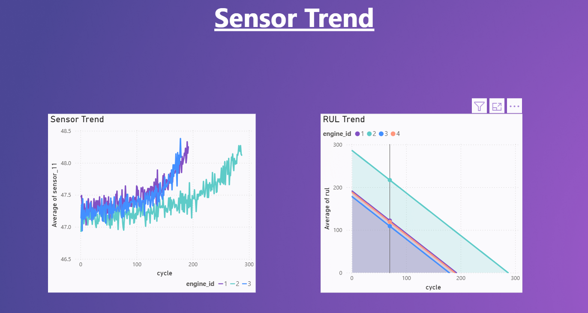

---

## 6. Monitoring

CloudWatch was used to monitor AWS Glue ETL execution logs.

The Glue job logs helped track:

- Job start
- Transformation progress
- Processed row counts
- Output writing
- Job success or failure

## 7. Security Considerations

Basic security practices followed in this project:

- S3 bucket was kept private
- Public access blocked
- IAM user account was used instead of root credentials
- IAM roles were used for AWS Glue
- Ensured not to hardcode AWS credentials in Python scripts
- AWS CLI was used for local authentication
- Terraform was used to manage infrastructure reproducibly

In a production setup, I would further improve it by:

- using least-privilege IAM policies
- storing secrets in AWS Secrets Manager
- enabling stricter bucket policies
- using VPC endpoints
- enabling more detailed audit logging with CloudTrail

## 8. Cost Control

This project was designed to run with very low AWS cost.

Cost-control steps:

- small dataset used
- Glue job run only a few times
- crawler run only when needed
- Athena queries kept minimal
- CloudWatch log retention set to 7 days
- AWS Budget alert configured

After testing, resources were removed using <i> terraform destroy </i>

## 9. Key Learnings

This project helped me understand:

- how to design an end-to-end data pipeline
- how to use S3 as raw and processed storage
- how AWS Glue performs cloud-based ETL
- how to perform data modeling by creating analytics-ready fact and summary tables
- how Glue Data Catalog stores metadata
- how Athena queries S3 data using SQL
- how Power BI can connect to Athena using ODBC driver
- how Terraform supports Infrastructure as Code
- how monitoring and security fit into a data pipeline

## 10.  Summary & Future Improvements

This project can be summarized as:

I built a cloud-based ETL pipeline using NASA CMAPSS jet engine sensor data. I used SQLite database to simulate a structured source system, Python (with boto3) to ingest data into Amazon S3, AWS Glue to transform the raw data, Glue Data Catalog and Athena to query the processed data and finally  Power BI to visualize the final insights. Terraform was used to provision AWS infrastructure and CloudWatch was used for monitoring.

#### Possible future enhancements:

1. Add Apache Airflow for orchestration
2. Store processed data in Parquet instead of CSV
3. Add partitioning for better Athena performance
4. Add CI/CD for Terraform deployment
5. Use Power BI scheduled refresh through Athena